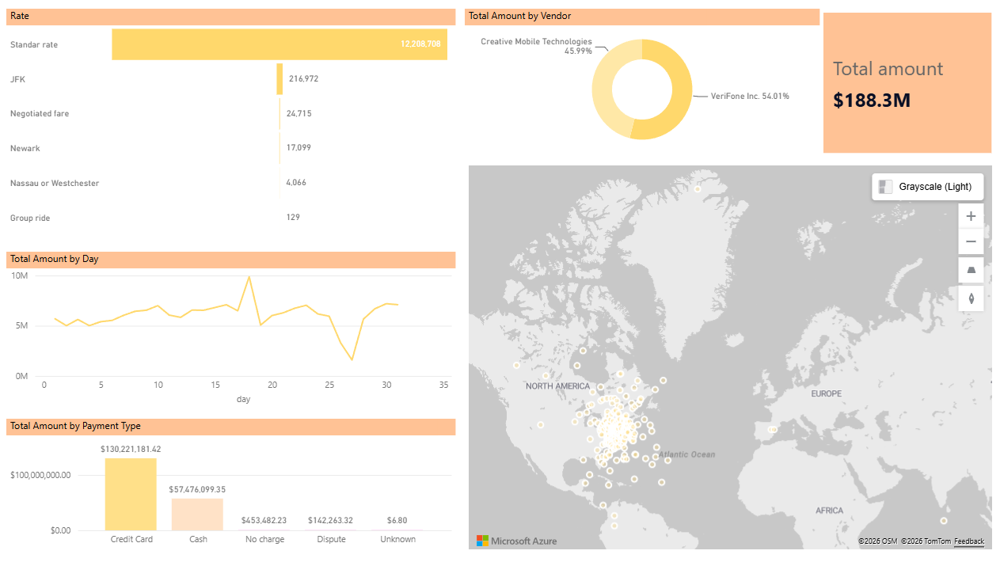

# 🚖 End-to-End Data Engineering Pipeline: NYC Taxi Dataset 

## Visión General del Proyecto
Este proyecto aborda un desafío crítico de rendimiento analítico: la optimización de reportes que superan las 24 horas de tiempo de actualización debido a cuellos de botella en la importación de datos masivos. 

Utilizando el dataset público de Taxis de Nueva York (enero de 2015, +12 millones de registros), se diseñó e implementó una canalización de datos distribuida en **Microsoft Fabric** utilizando la **Arquitectura Medallion** (Bronze, Silver, Gold). El resultado final es un modelo dimensional conectado a Power BI mediante **Direct Lake**, reduciendo la latencia de actualización prácticamente a cero.

## Arquitectura de la Solución (Medallion Architecture)

1. **Capa Bronze (Ingesta):** Extracción de datos transaccionales en bruto hacia OneLake sin modificaciones, simulando la extracción desde un entorno On-Premise.
2. **Capa Silver (Limpieza y Transformación):** Procesamiento distribuido con **PySpark**.
   - Eliminación de registros duplicados.
   - Imputación y manejo estricto de valores nulos en campos críticos (distancia, tarifa).
   - Filtrado geoespacial y de reglas lógicas financieras (eliminación de tarifas negativas y coordenadas erróneas tipo *Null Island*).
3. **Capa Gold (Modelado Dimensional):** Transformación hacia un esquema estrella (Star Schema) estructurado en formato **Delta Table**, separando la tabla de hechos (`fact_trips`) de sus dimensiones (`dim_date`, `dim_payment`, etc.).

## Stack Tecnológico
* **Orquestación y Procesamiento:** Microsoft Fabric, Apache Spark (PySpark), Python.
* **Almacenamiento:** OneLake, Delta Parquet.
* **Modelado y Visualización:** SQL Analytics Endpoint, Power BI, DAX, Direct Lake.

## Insights Clave de Negocio (Enero 2015)
El modelo de datos permitió descubrir los siguientes hallazgos al analizar el reporte final:
* **Ingresos y Adopción:** Un volumen de recaudación de **$188.3M**, donde la tarjeta de crédito ya dominaba el mercado con más de 7 millones de transacciones.
* **Competitividad:** Un duopolio equilibrado en la provisión de tecnología en los vehículos (VeriFone Inc. con 54.01% y Creative Mobile Technologies con 45.99%).
* **Anomalía Climática:** Se identificó una caída drástica en el volumen de ingresos entre el 26 y 27 de enero, que cruzado con datos históricos, corresponde directamente a la tormenta de nieve histórica que paralizó la ciudad de Nueva York.

## Cómo ejecutar este proyecto
1. Clonar este repositorio: `git clone https://github.com/Bidobelemti/yellowtrip_dataset`
2. Importar los Notebooks (`.ipynb`) directamente al Workspace de Microsoft Fabric.
3. Actualizar la ruta `Files/` en el código de lectura para que apunte a tu propio Lakehouse.
4. Ejecutar el pipeline de procesamiento Bronze -> Silver -> Gold.
5. Conectar el modelo semántico en Fabric hacia Power BI vía Direct Lake.

## Dashboard y Resultados

## Autor
**Bryan Mauricio Morales Tituaña**  
*Computer Science Student*  
[LinkedIn](https://www.linkedin.com/in/mauricio-morales-87651b305) | [GitHub](https://github.com/Bidobelemti)